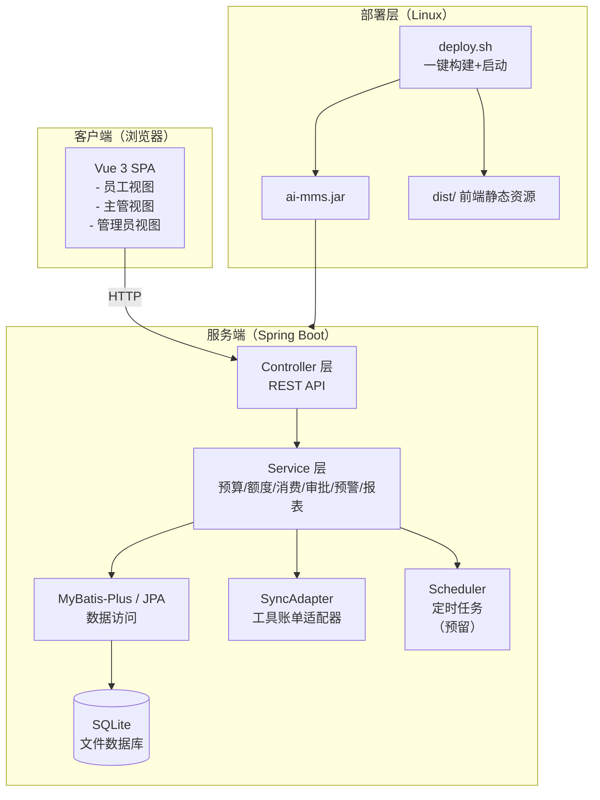
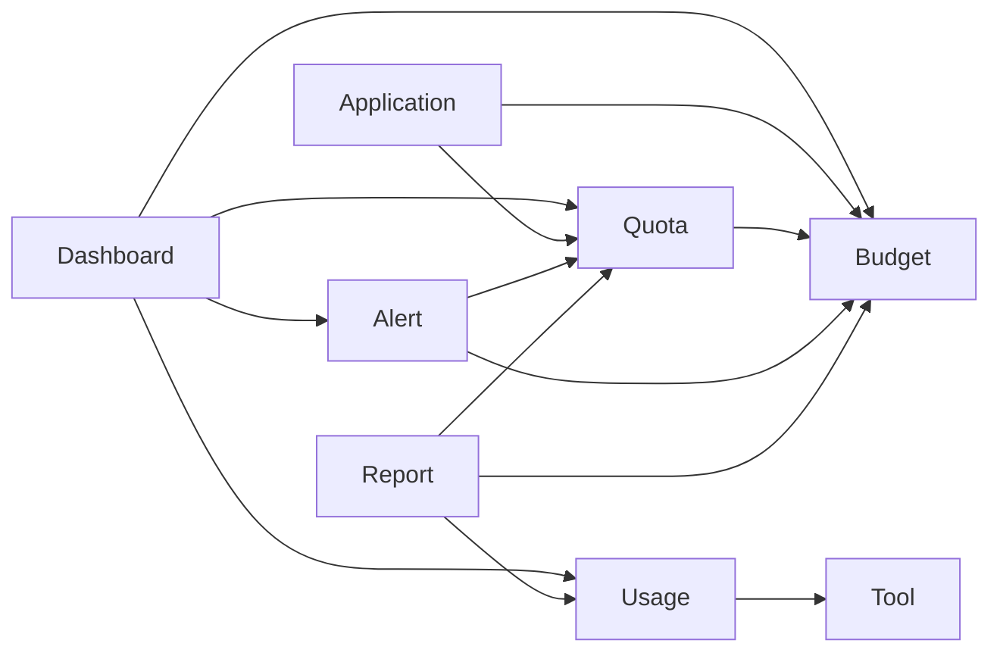
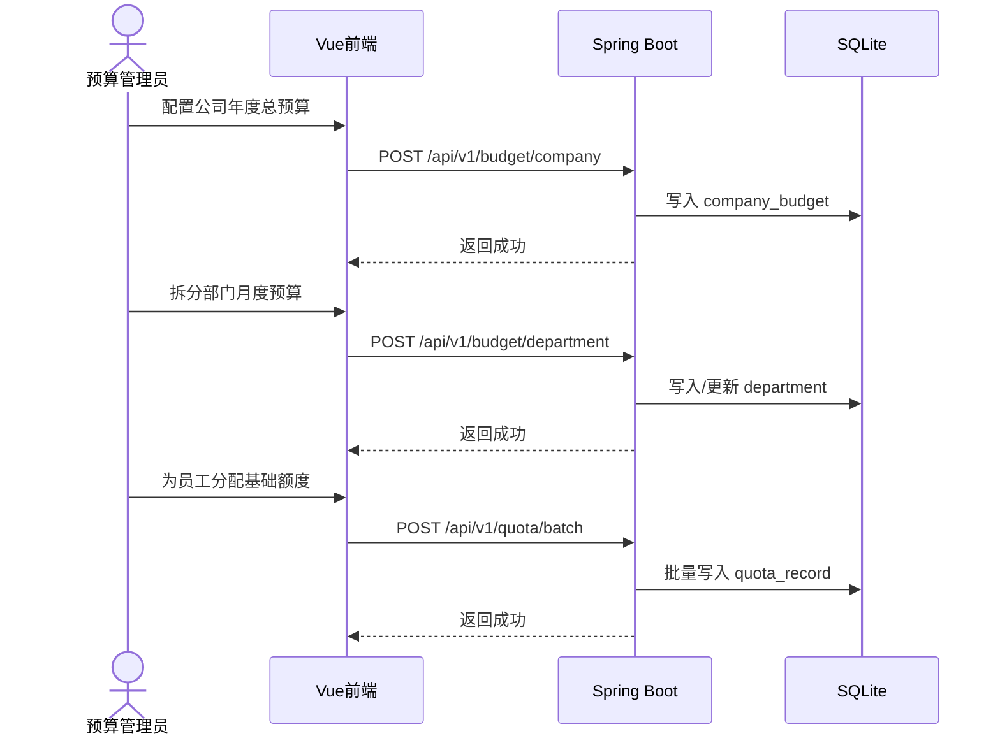
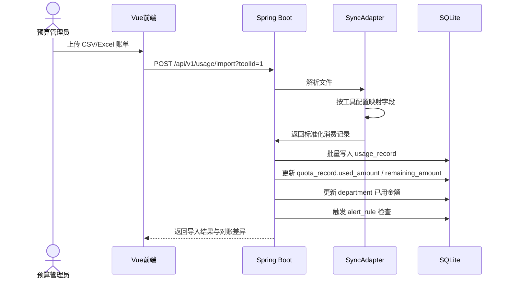
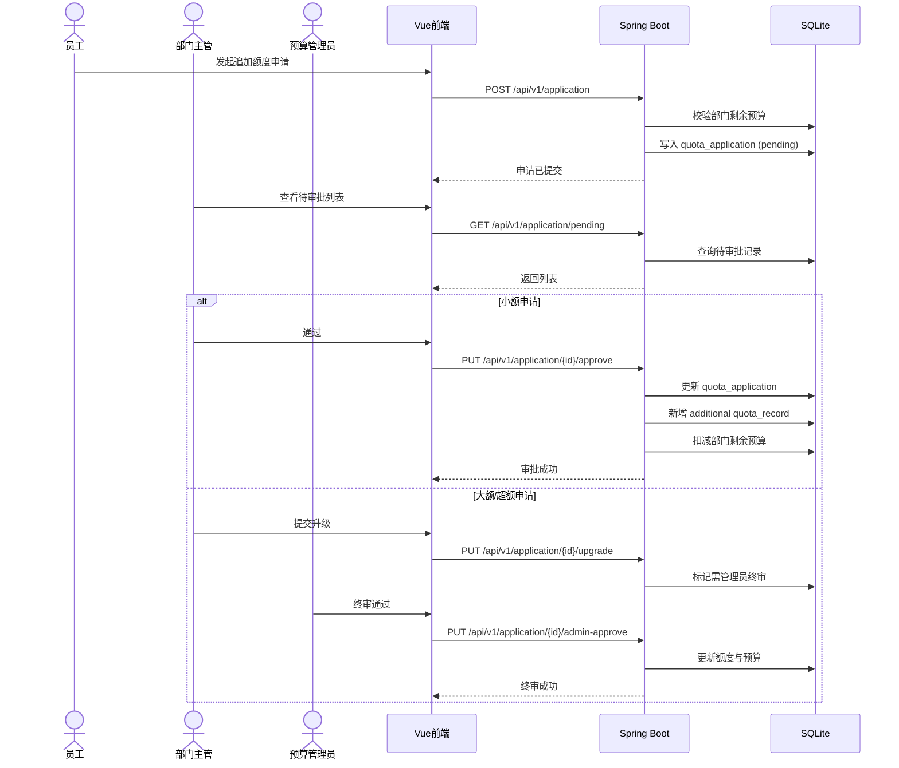
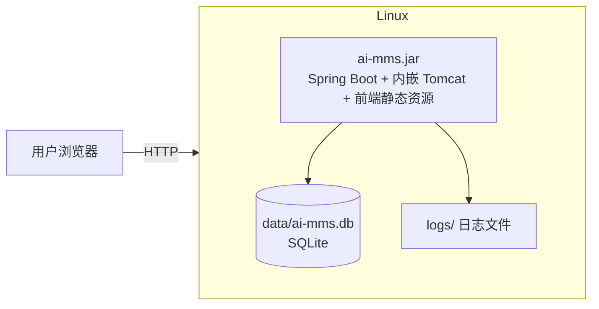

# AI 费用管理平台 MVP 架构设计方案

**文档版本**：V1.0  
**编制日期**：2026-08-13  
**目标读者**：架构师、技术负责人、开发团队、项目经理  

---

## 1. 架构概览

### 1.1 系统定位与一句话目标

**一句话目标**：构建一个“Java + Vue + SQLite”的轻量级单体应用，通过 CSV 导入快速归集 8 款 AI 工具账单，实现预算-额度-消费-预警-审批的闭环管理，并能在 Linux 环境下通过一条命令完成部署启动。

### 1.2 设计原则

| 原则 | 说明 |
|---|---|
| **极简优先** | 1 小时上线决定首版只保留核心链路，所有非必要功能延后。 |
| **单体优先** | 不拆分微服务，Spring Boot 单工程 + Vue 单页面应用，降低部署与联调成本。 |
| **文件型数据库** | 使用 SQLite，零运维、零配置、随应用一起打包。 |
| **配置化接入** | 工具/模型/费率通过后台配置，新增工具不改动代码。 |
| **一键部署** | 提供 Shell 脚本，单条命令完成环境检查、构建、启动。 |
| **可演进** | 保留标准接口与数据模型，后续可平滑迁移到 MySQL/PostgreSQL、微服务或 SSO。 |

---

## 2. 需求与约束回顾

### 2.1 功能性需求摘要

- **预算配置**：公司年度/月度总预算、部门预算拆分、预算调整留痕。
- **工具管理**：8 款 AI 工具基础信息、计费模式、模型/套餐/费率配置。
- **额度管理**：个人月度基础额度、追加额度、额度扣减、剩余查询。
- **消费归集**：CSV/Excel 导入账单，解析为统一消费记录；预留 API 同步适配器。
- **申请审批**：员工发起额度申请 → 主管审批 → 大额升级管理员 → 自动更新额度。
- **预警通知**：个人/部门/公司三级阈值预警，站内消息。
- **分层看板**：员工个人视图、部门主管视图、预算管理员全局视图。
- **报表导出**：消费明细、预算执行率、模型费用排行导出。

### 2.2 非功能性需求

| 维度 | 指标 | 说明 |
|---|---|---|
| **性能** | 看板加载 ≤ 3 秒 | 百人规模、万级消费记录，SQLite + 索引可满足。 |
| **并发** | 峰值 ≤ 50 QPS | 内部管理后台，并发极低，单体足够。 |
| **可用性** | 无强 SLA 要求 | MVP 阶段允许计划内维护窗口。 |
| **安全** | 角色数据隔离 | 无登录态，前端通过固定角色切换 + 后端按角色过滤数据。 |
| **扩展性** | 新增工具通过配置接入 | 预留 `SyncAdapter` 接口。 |
| **部署** | Linux 一键启动 | 提供 `deploy.sh`，构建 + 启动一体化。 |

### 2.3 假设与待确认项

#### 假设
1. **规模假设**：公司员工 ≤ 200 人，8 款工具，月度消费记录 ≤ 1 万条，SQLite 单文件可承载。
2. **数据假设**：首版以 CSV/Excel 导入为主，工具 API 适配后续按需实现。
3. **登录假设**：MVP 无登录，通过 URL 参数或页面顶部角色切换器模拟“员工/主管/管理员”身份。
4. **部署假设**：目标 Linux 服务器已安装 JDK 17+、Node.js 18+，或采用 Docker 一键镜像。
5. **工期假设**：1 小时上线指“可运行的 MVP 首版”，而非完整企业级系统。

#### 待确认项（MVP 后）
1. 是否需要后续对接企业账号体系（钉钉/飞书/SSO）。
2. 8 款工具中是否有可提供 API 的，优先接入哪几款。
3. 是否需要邮件/钉钉通知渠道。
4. 预算周期是自然月清零，还是季度/项目制结转。
5. 是否需要多币种实时汇率接口。

---

## 3. 总体架构

### 3.1 架构风格选择

**选择：模块化单体架构（Modular Monolith）**

| 方案 | 优点 | 缺点 | 本场景取舍 |
|---|---|---|---|
| 微服务 | 独立扩展、技术异构 | 部署复杂、联调成本高、1 小时无法完成 | ❌ 放弃 |
| 单体分层 | 简单、快速、易部署 | 长期扩展性受限 | ✅ 选择，符合 1 小时上线约束 |
| Serverless | 免运维 | 技术栈绑定、调试复杂 | ❌ 放弃 |

### 3.2 系统拓扑图



---

## 4. 模块/服务划分

### 4.1 后端模块（Spring Boot 单工程）

| 模块名 | 职责 | 对外接口 |
|---|---|---|
| `budget` | 公司预算、部门预算配置与调整 | `/api/budget/**` |
| `tool` | AI 工具、模型、费率、同步方式配置 | `/api/tool/**` |
| `quota` | 个人额度记录、额度扣减、剩余查询 | `/api/quota/**` |
| `usage` | 消费记录导入、解析、对账、聚合 | `/api/usage/**` |
| `application` | 额度申请、审批流程、审批记录 | `/api/application/**` |
| `alert` | 预警规则、预警触发、站内消息 | `/api/alert/**` |
| `dashboard` | 员工/主管/管理员看板数据聚合 | `/api/dashboard/**` |
| `report` | 报表生成与导出（CSV/Excel/PDF） | `/api/report/**` |
| `sync` | 工具账单同步适配器框架 | `/api/sync/**` |
| `system` | 用户/角色、审计日志、基础配置 | `/api/system/**` |

### 4.2 前端模块（Vue 3 单页面应用）

| 模块名 | 职责 |
|---|---|
| `views/employee` | 个人消费总览、工具明细、剩余额度、申请 |
| `views/manager` | 部门看板、模型分布、成员排名、审批、额度分配 |
| `views/admin` | 全局看板、预算配置、工具/费率管理、预警配置、报表 |
| `components` | 图表组件（ECharts）、表格、表单、审批流程 |
| `api` | Axios 封装，按模块调用后端接口 |
| `store` | Pinia 状态管理，当前角色、用户信息、全局配置 |

### 4.3 模块间依赖关系



### 4.4 通信方式

- **前后端**：RESTful API，JSON 格式。
- **后端内部**：Spring 依赖注入，方法调用。
- **定时任务**：Spring `@Scheduled`，预留 Quartz 扩展。
- **文件导入**：前端上传 CSV/Excel → 后端解析入库。
- **通知**：MVP 阶段使用站内消息表 + 前端轮询（后续可接入 WebSocket）。

---

## 5. 关键设计决策

### 5.1 技术选型清单

| 层级 | 技术 | 选型理由 | 放弃方案 |
|---|---|---|---|
| 后端语言 | **Java 17 + Spring Boot 3.x** | 团队熟悉，生态成熟，快速开发 | Go/Python/Node.js |
| ORM/数据访问 | **MyBatis-Plus** | 简化 CRUD、分页、代码生成，适合 MVP 快速迭代 | JPA（学习成本略高）、JDBC（繁琐） |
| 数据库 | **SQLite** | 零配置、文件型、随应用打包，1 小时上线最友好 | MySQL/PostgreSQL（需独立部署） |
| 前端框架 | **Vue 3 + Vite + Element Plus** | 团队熟悉，组件丰富，构建快 | React/Ant Design |
| 图表 | **ECharts** | 与 Vue 集成成熟，支持饼图/柱状图/折线图 | D3.js（开发成本高） |
| 任务调度 | **Spring @Scheduled** | 足够简单，满足定时同步预留 | Quartz/XXL-Job（过重） |
| 文件处理 | **EasyExcel / Apache POI** | 处理 Excel 导入导出 | 纯 CSV 解析（功能弱） |
| 构建工具 | **Maven** | Java 团队主流，插件成熟 | Gradle |
| 部署方式 | **Spring Boot 内嵌 Tomcat + 前端静态资源打包** | 一个 JAR 包直接运行 | 前后端分离 Nginx 部署（多一步配置） |

### 5.2 数据模型与存储设计

#### 5.2.1 核心表结构

```sql
-- 公司预算
CREATE TABLE company_budget (
    id INTEGER PRIMARY KEY AUTOINCREMENT,
    fiscal_year INTEGER NOT NULL,
    total_budget_cny DECIMAL(18,4) NOT NULL,
    total_budget_usd DECIMAL(18,4) DEFAULT 0,
    exchange_rate DECIMAL(10,6) DEFAULT 7.1,
    created_at DATETIME DEFAULT CURRENT_TIMESTAMP,
    updated_at DATETIME DEFAULT CURRENT_TIMESTAMP
);

-- 部门
CREATE TABLE department (
    id INTEGER PRIMARY KEY AUTOINCREMENT,
    company_id INTEGER NOT NULL,
    name VARCHAR(100) NOT NULL,
    monthly_budget_cny DECIMAL(18,4) NOT NULL,
    manager_id INTEGER,
    created_at DATETIME DEFAULT CURRENT_TIMESTAMP
);

-- 用户
CREATE TABLE sys_user (
    id INTEGER PRIMARY KEY AUTOINCREMENT,
    dept_id INTEGER NOT NULL,
    username VARCHAR(100) NOT NULL,
    email VARCHAR(100),
    role VARCHAR(20) NOT NULL, -- employee/manager/admin
    tool_accounts TEXT, -- JSON
    created_at DATETIME DEFAULT CURRENT_TIMESTAMP
);

-- AI 工具
CREATE TABLE ai_tool (
    id INTEGER PRIMARY KEY AUTOINCREMENT,
    name VARCHAR(100) NOT NULL,
    billing_mode VARCHAR(20) NOT NULL, -- seat/token/credit/mixed
    currency VARCHAR(10) NOT NULL, -- CNY/USD
    sync_type VARCHAR(20) NOT NULL, -- api/file/manual
    sync_config TEXT, -- JSON
    created_at DATETIME DEFAULT CURRENT_TIMESTAMP
);

-- AI 模型/套餐
CREATE TABLE ai_model (
    id INTEGER PRIMARY KEY AUTOINCREMENT,
    tool_id INTEGER NOT NULL,
    name VARCHAR(100) NOT NULL,
    unit_price DECIMAL(18,6) NOT NULL,
    unit VARCHAR(20) NOT NULL, -- token/credit/seat_month
    tiered_pricing TEXT, -- JSON
    created_at DATETIME DEFAULT CURRENT_TIMESTAMP
);

-- 个人额度记录
CREATE TABLE quota_record (
    id INTEGER PRIMARY KEY AUTOINCREMENT,
    user_id INTEGER NOT NULL,
    dept_id INTEGER NOT NULL,
    period VARCHAR(7) NOT NULL, -- yyyy-MM
    quota_type VARCHAR(20) NOT NULL, -- monthly_base/additional
    total_amount DECIMAL(18,4) NOT NULL,
    used_amount DECIMAL(18,4) DEFAULT 0,
    remaining_amount DECIMAL(18,4) NOT NULL,
    source_application_id INTEGER,
    created_at DATETIME DEFAULT CURRENT_TIMESTAMP
);

-- 消费记录
CREATE TABLE usage_record (
    id INTEGER PRIMARY KEY AUTOINCREMENT,
    user_id INTEGER,
    dept_id INTEGER NOT NULL,
    tool_id INTEGER NOT NULL,
    model_id INTEGER,
    usage_date DATE NOT NULL,
    usage_quantity DECIMAL(18,4),
    original_amount DECIMAL(18,4),
    original_currency VARCHAR(10),
    amount_cny DECIMAL(18,4) NOT NULL,
    source VARCHAR(20) NOT NULL, -- api/import/manual
    raw_data TEXT, -- 原始账单JSON
    created_at DATETIME DEFAULT CURRENT_TIMESTAMP
);

-- 额度申请
CREATE TABLE quota_application (
    id INTEGER PRIMARY KEY AUTOINCREMENT,
    applicant_id INTEGER NOT NULL,
    dept_id INTEGER NOT NULL,
    type VARCHAR(20) NOT NULL, -- base/additional
    amount DECIMAL(18,4) NOT NULL,
    reason TEXT,
    status VARCHAR(30) NOT NULL, -- pending/manager_approved/admin_approved/rejected
    approver_id INTEGER,
    approve_comment TEXT,
    created_at DATETIME DEFAULT CURRENT_TIMESTAMP,
    updated_at DATETIME DEFAULT CURRENT_TIMESTAMP
);

-- 预警规则
CREATE TABLE alert_rule (
    id INTEGER PRIMARY KEY AUTOINCREMENT,
    target_type VARCHAR(20) NOT NULL, -- company/department/user
    target_id INTEGER NOT NULL,
    threshold_pct INTEGER NOT NULL,
    notify_roles VARCHAR(100),
    enabled BOOLEAN DEFAULT 1
);

-- 预警日志
CREATE TABLE alert_log (
    id INTEGER PRIMARY KEY AUTOINCREMENT,
    rule_id INTEGER NOT NULL,
    target_type VARCHAR(20) NOT NULL,
    target_id INTEGER NOT NULL,
    actual_pct INTEGER NOT NULL,
    message TEXT,
    created_at DATETIME DEFAULT CURRENT_TIMESTAMP
);

-- 审计日志
CREATE TABLE audit_log (
    id INTEGER PRIMARY KEY AUTOINCREMENT,
    operator_id INTEGER,
    action VARCHAR(50) NOT NULL,
    target_type VARCHAR(50),
    target_id INTEGER,
    old_value TEXT,
    new_value TEXT,
    created_at DATETIME DEFAULT CURRENT_TIMESTAMP
);
```

#### 5.2.2 索引策略

```sql
-- 高频查询索引
CREATE INDEX idx_quota_user_period ON quota_record(user_id, period);
CREATE INDEX idx_usage_user_date ON usage_record(user_id, usage_date);
CREATE INDEX idx_usage_dept_date ON usage_record(dept_id, usage_date);
CREATE INDEX idx_usage_tool_date ON usage_record(tool_id, usage_date);
CREATE INDEX idx_application_applicant ON quota_application(applicant_id, status);
CREATE INDEX idx_application_dept ON quota_application(dept_id, status);
CREATE INDEX idx_alert_log_target ON alert_log(target_type, target_id, created_at);
```

#### 5.2.3 缓存策略

- **MVP 阶段不使用 Redis**，因为并发低、数据量小，SQLite + 索引已足够。
- 看板聚合查询若变慢，可在 `quota_record` / `usage_record` 中增加月度汇总表，或通过定时任务预计算。
- 后续若接入实时 API 或并发提升，再引入 Redis + MySQL。

### 5.3 接口设计

#### 5.3.1 API 风格

- **RESTful API**，统一前缀 `/api/v1`。
- 统一响应格式：

```json
{
  "code": 200,
  "message": "success",
  "data": {}
}
```

#### 5.3.2 核心接口示例

| 模块 | 接口 | 说明 |
|---|---|---|
| 看板 | `GET /api/v1/dashboard/employee` | 员工个人看板 |
| 看板 | `GET /api/v1/dashboard/manager?deptId=1` | 部门主管看板 |
| 看板 | `GET /api/v1/dashboard/admin` | 预算管理员全局看板 |
| 额度 | `GET /api/v1/quota/remaining?userId=1` | 查询剩余额度 |
| 消费 | `POST /api/v1/usage/import` | 导入消费账单 |
| 申请 | `POST /api/v1/application` | 提交额度申请 |
| 审批 | `PUT /api/v1/application/{id}/approve` | 审批通过 |
| 工具 | `GET /api/v1/tool` | 工具列表 |
| 报表 | `GET /api/v1/report/export?type=usage&format=xlsx` | 导出报表 |

#### 5.3.3 鉴权策略

- **MVP 无登录态**，前端通过 URL 参数或 LocalStorage 存储当前角色/用户 ID。
- 后端接口按 `role` 和 `userId` 参数做数据范围过滤：
  - 员工：只能查自己的数据。
  - 主管：只能查本部门数据。
  - 管理员：可查全局数据。
- **风险说明**：此方案仅适用于内部可信环境，正式环境必须接入认证。

### 5.4 核心业务流程时序

#### 5.4.1 月度预算初始化流程



#### 5.4.2 消费账单导入与额度扣减流程



#### 5.4.3 额度申请与审批流程



---

## 6. 非功能性设计

### 6.1 性能与容量

| 指标 | 预估 | 优化手段 |
|---|---|---|
| 峰值 QPS | ≤ 50 | 单体 + SQLite 完全满足 |
| 并发用户 | ≤ 50 | 内嵌 Tomcat 默认线程池足够 |
| 月度消费记录 | ≤ 1 万条 | 按日期/用户/部门建索引 |
| 看板加载 | ≤ 3 秒 | 预计算月度汇总，避免全表聚合 |
| 文件导入 | 5000 条 ≤ 5 分钟 | 批量插入（MyBatis-Plus saveBatch） |

### 6.2 高可用与容灾

- **MVP 阶段**：单实例部署，不追求高可用。
- **数据备份**：SQLite 文件可直接复制备份，提供 `backup.sh` 脚本。
- **故障转移**：暂不做主从/集群，后续迁移到 MySQL 后可扩展。
- **优雅停机**：Spring Boot 支持 graceful shutdown。

### 6.3 安全

| 层面 | 措施 |
|---|---|
| 数据传输 | 内网部署可暂用 HTTP；生产环境建议 Nginx 反向代理 + HTTPS |
| 数据存储 | 敏感配置（如 API Token）加密存储 |
| 访问控制 | 后端按 role 参数做数据范围过滤 |
| 审计 | 预算调整、审批、额度变更写入 audit_log |
| **已知风险** | 无登录态，仅适合内部可信环境；正式上线必须接入认证 |

### 6.4 可观测性

| 维度 | 方案 |
|---|---|
| 日志 | SLF4J + Logback，输出到控制台与文件 |
| 指标 | Spring Boot Actuator + Micrometer（预留 Prometheus） |
| 链路追踪 | MVP 阶段不做 |
| 健康检查 | `/actuator/health` |

### 6.5 可扩展性

| 扩展点 | 设计 |
|---|---|
| 新增 AI 工具 | 配置 `ai_tool` / `ai_model` / `tool_rate`，实现 `SyncAdapter` 接口 |
| 新增计费模式 | 在 `billing_mode` 枚举与消费解析器中扩展 |
| 数据库升级 | 预留 Flyway/Liquibase 迁移脚本，后续迁移 MySQL |
| 实时同步 | 预留 `Scheduler` + `SyncAdapter`，后续替换为消息队列 |
| 登录认证 | 预留 `sys_user` 表与角色字段，后续接入 SSO |

---

## 7. 部署与运维架构

### 7.1 部署拓扑



### 7.2 一键部署脚本 `deploy.sh`

```bash
#!/bin/bash
set -e

APP_NAME="ai-mms"
JAVA_VERSION="17"
NODE_VERSION="18"

echo "[1/5] 检查环境..."
java -version
node -v
npm -v

echo "[2/5] 编译前端..."
cd frontend
npm install
npm run build
cd ..

echo "[3/5] 复制前端资源到后端..."
mkdir -p backend/src/main/resources/static
cp -r frontend/dist/* backend/src/main/resources/static/

echo "[4/5] 编译后端..."
cd backend
mvn clean package -DskipTests
cd ..

echo "[5/5] 启动应用..."
mkdir -p data logs
nohup java -jar backend/target/${APP_NAME}-0.0.1-SNAPSHOT.jar \
  --spring.profiles.active=prod \
  --server.port=8080 \
  --sqlite.path=./data/ai-mms.db \
  > logs/app.log 2>&1 &

echo "应用已启动，访问 http://服务器IP:8080"
```

### 7.3 CI/CD 与发布策略

- **MVP 阶段**：本地/测试机执行 `deploy.sh` 手动发布。
- **版本控制**：Git + Maven 版本号管理。
- **灰度与回滚**：
  - 停止旧进程 → 备份 SQLite → 启动新 JAR。
  - 回滚时恢复旧 JAR 与数据库备份。
- **后续演进**：引入 GitLab CI/Jenkins，构建 Docker 镜像，部署到 K8s。

---

## 8. 风险与权衡

### 8.1 关键技术风险及缓解

| 风险 | 影响 | 缓解措施 |
|---|---|---|
| **1 小时工期过紧** | 只能实现最核心功能，代码质量与测试覆盖不足 | 首版聚焦“预算配置 + CSV 导入 + 看板展示”，审批与预警可简化；后续迭代补齐 |
| **SQLite 并发与容量瓶颈** | 多用户同时写入可能锁表；数据量大后性能下降 | 百人规模内可用；后续迁移到 MySQL/PostgreSQL |
| **无登录态导致数据安全风险** | 内部人员可通过改 URL 查看他人数据 | MVP 仅在内网使用；正式上线前接入认证 |
| **AI 工具账单格式未知** | CSV 导入字段映射可能不准 | 提供通用模板与可配置的字段映射；预留适配器接口 |
| **额度无法实时拦截** | 事后预警无法控制实际消费 | 通过审批+预警+主管问责实现软控；与工具侧协商 API 限制（长期） |

### 8.2 架构层面的技术债与演进路线

| 阶段 | 技术债/演进点 | 建议时机 |
|---|---|---|
| **V1.0 MVP** | SQLite 单文件、无登录、前端角色切换、CSV 导入 | 立即 |
| **V1.1** | 接入 MySQL/PostgreSQL，增加登录认证（SSO） | 上线后 2-4 周 |
| **V1.2** | 接入 2-3 款工具 API 自动同步，减少人工导入 | 明确工具 API 后 |
| **V1.3** | 引入 Redis 缓存 + 消息队列，提升并发与通知实时性 | 用户规模扩大后 |
| **V2.0** | 拆分为微服务（预算、消费、审批、预警独立部署） | 业务量与团队规模扩大后 |

---

## 9. 实施路线图

### 9.1 里程碑划分

| 里程碑 | 内容 | 优先级 | 预计工时 |
|---|---|---|---|
| **M0：项目脚手架** | Spring Boot + Vue 初始化、SQLite 配置、统一返回结构、部署脚本 | P0 | 15 min |
| **M1：基础数据管理** | 公司/部门预算 CRUD、用户/角色管理、AI 工具/模型/费率配置 | P0 | 15 min |
| **M2：额度管理** | 个人基础额度分配、剩余额度查询、额度扣减逻辑 | P0 | 15 min |
| **M3：消费归集** | CSV/Excel 导入、消费记录解析、对账差异展示 | P0 | 15 min |
| **M4：看板与报表** | 员工/主管/管理员三层看板、模型分布、成员排名、导出 | P1 | 后续迭代 |
| **M5：申请审批** | 额度申请、主管审批、管理员终审、审批记录 | P1 | 后续迭代 |
| **M6：预警通知** | 预警规则配置、阈值触发、站内消息 | P1 | 后续迭代 |

### 9.2 人力与工期粗略评估

> 基于“AI 开发 1 小时上线”的强约束，首版必须极限裁剪。

| 阶段 | 人力 | 目标 |
|---|---|---|
| **第 1 小时（MVP）** | 2-3 人（1 后端 + 1 前端 + 1 部署） | 完成 M0-M3，实现“预算配置 → 额度分配 → CSV 导入 → 看板展示”最核心链路 |
| **第 1 天** | 5-10 人 | 补齐 M4-M6，形成完整闭环，可内部试用 |
| **第 1 周** | 20 人团队并行 | 接入真实账单、打磨体验、补充测试、修复问题、准备上线 |

### 9.3 1 小时 MVP 的最小功能集

为达成 1 小时上线，首版必须只保留：

1. **管理员**：配置公司/部门预算、添加 AI 工具与模型、上传 CSV 账单。
2. **主管**：查看部门消费总额、模型分布、成员排名。
3. **员工**：查看个人消费与剩余额度。
4. **系统**：解析 CSV → 写入消费记录 → 更新额度 → 刷新看板。

审批、预警、导出等功能在首版可用模拟数据或硬编码，后续 1 天内补齐。

---

## 10. 架构方案结论

本方案采用 **Java + Spring Boot + Vue + SQLite** 的模块化单体架构，以“极简、可一键部署、可快速演进”为核心设计目标，适配 1 小时 MVP 上线的强约束。

**核心取舍：**
- 选 SQLite 而非 MySQL：零运维、随应用打包，但承认并发与容量上限。
- 选单体而非微服务：降低部署与联调成本，但承认长期扩展性需要重构。
- 选 CSV 导入而非 API 同步：快速可用，但需后续适配真实工具接口。
- 选无登录态：节省开发时间，但明确这是内部 MVP 临时方案，正式上线前必须接入认证。

**下一步建议：**
1. 确认 1 小时 MVP 的最小功能集是否可接受。
2. 提供 SQLite 初始化脚本与 CSV 导入模板。
3. 启动项目脚手架搭建。

---

**文档结束**
